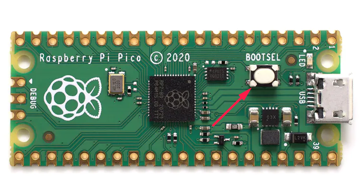
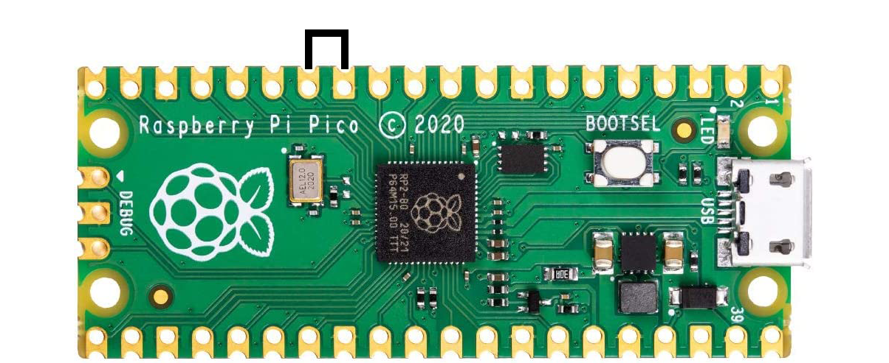

<h1 align="center">pico-ducky</h1>

  <strong>Make a cheap but powerful USB Rubber Ducky with a Raspberry Pi Pico</strong>

 

  
  
  
  
  

 

## Usage

Install and have your USB Rubber Ducky working in less than 5 minutes.

1. Clone this repository or [download it as zip](https://github.com/dbisu/pico-ducky/archive/refs/heads/main.zip) and extract it.

2. Plug your Raspberry Pi Pico into a USB port. It should show up as a mass storage device named `RPI-RP2`.

3. Copy the `adafruit-circuitpython-raspberry_pi_pico-en_US-7.0.0.uf2` file from the folder you cloned / extracted this repository to the root of the Pico (`RPI-RP2`). The device will reboot and after a second or so, and reconnect as `CIRCUITPY`, with a `lib` folder, `boot_out.txt` and `code.py` .

5. Navigate to the folder you cloned / extracted this repository and copy the `adafruit_hid` folder to the `lib` folder in your Raspberry Pi Pico.

6. Delete the `code.py` in your Raspberry Pi Pico, copy `code.py` from the folder you cloned / extracted this repository to your Raspberry Pi Pico.

7. Find a script [here](https://github.com/hak5darren/USB-Rubber-Ducky/wiki/Payloads) or [create your own one using Ducky Script](https://github.com/hak5darren/USB-Rubber-Ducky/wiki/Duckyscript) and save it as `payload.dd` in your Raspberry Pi Pico root.

8. Finally, make sure you have a `lib` folder with `adafruit-hid` folder in it, a `boot_out.txt`, `code.py` and `payload.dd`. Now your Raspberry Pi Pico is a **USB Rubber Ducky**. 

9. Be careful, if your device isn't in [setup mode](#setup-mode), the device will reboot and after half a second, the script will run.

## Setup mode

To edit the payload, enter setup mode by connecting the pin 1 (`GP0`) to pin 3 (`GND`), this will stop the pico-ducky from injecting the payload in your own machine.
The easiest way to so is by using a jumper wire between those pins as seen bellow.

## Reset 

If you don't have a jumper wire or you want a more convenient way to edit your payload, resetting it will be a great choice.

1. Hold the `BOOTSEL` button while plugging your Raspberry Pi Pico to a USB port.
2. Download the [flash_nuke.uf2](https://datasheets.raspberrypi.org/soft/flash_nuke.uf2) file.
3. Copy the `flash_nuke.uf2` file to you Raspberry Pi Pico (`RPI-RP2`)
4. Your Raspberry Pi Pico will reboot after half a second and your Raspberry Pi Pico is resetted.

Now you can just repeat steps in [usage](#usage) to setup your pico-ducky.

## USB enable/disable mode

If you need the pico-ducky to not show up as a USB mass storage device for stealth, follow these instructions.  
1. Enter [setup mode](#setup-mode).  
2. Copy `boot.py` from the folder you cloned / extracted this repository to the root of the pico-ducky.  
3. Copy your payload script to the pico-ducky.  
4. Disconnect the pico from your host PC.
5. Connect a jumper wire between pin 18 and pin 20. This will prevent the pico-ducky from showing up as a USB drive when plugged into the target device.  
6. Remove the jumper wire and reconnect to your PC to reprogram.

The default mode is USB mass storage enabled.   

## Useful links and resources

### Docs

[CircuitPython](https://circuitpython.readthedocs.io/en/6.3.x/README.html)

[CircuitPython HID](https://learn.adafruit.com/circuitpython-essentials/circuitpython-hid-keyboard-and-mouse)

[Ducky Script](https://github.com/hak5darren/USB-Rubber-Ducky/wiki/Duckyscript)

### Video tutorials

[pico-ducky tutorial by **NetworkChuck**](https://www.youtube.com/watch?v=e_f9p-_JWZw)

[USB Rubber Ducky playlist by **Hak5**](https://www.youtube.com/playlist?list=PLW5y1tjAOzI0YaJslcjcI4zKI366tMBYk)

[CircuitPython tutorial on the Raspberry Pi Pico by **DroneBot Workshop**](https://www.youtube.com/watch?v=07vG-_CcDG0)
