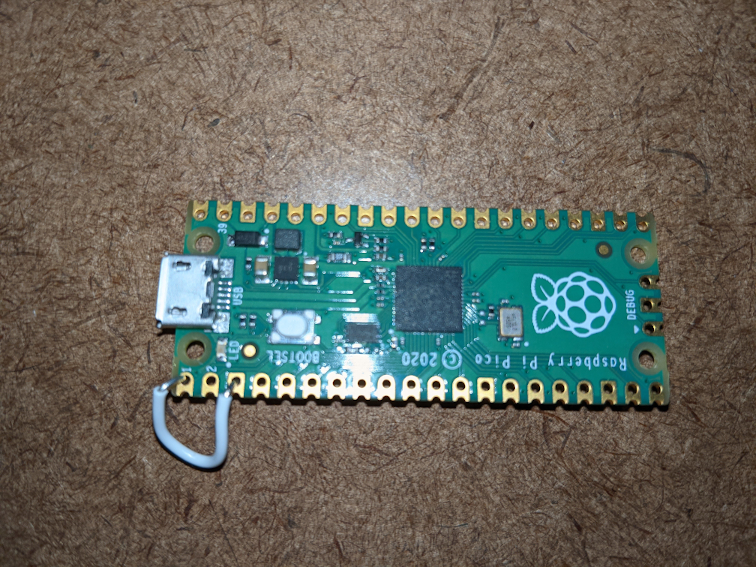

# pico-ducky
Create a USB Rubber Ducky like device using a Raspberry PI Pico

Download circuitpython for pico board:
https://circuitpython.org/board/raspberry_pi_pico/

Plug the Pico board into a USB port.
The board will show up as a removable media device.
Copy the UF2 file to the root of the media device.

The Pico board will reboot after installing the firmware image.

Download additional libraries:
https://github.com/adafruit/Adafruit_CircuitPython_Bundle

https://github.com/adafruit/Adafruit_CircuitPython_Bundle/releases/tag/20210130

from zip file, unpack adafruit_hid folder.
copy adafruit_hid to the lib folder.

Circuitpy HID
https://learn.adafruit.com/circuitpython-essentials/circuitpython-hid-keyboard-and-mouse

# Ducky Script Python
Copy duckyinpython.py to the root of the media device as code.py

$ cp duckyinpython.py /<path to media device>/code.py

Copy your Ducky Scipt file as payload.dd

$ cp <duckyscriptfile> /path to media device>/payload.dd

# NEW: added support for a programming switch.  
Tie pin 0 (GPIO0) to pin 3 (GND) to not automatically run payloads.
Easiest way to do this is to add a jumper wire between those pins.

